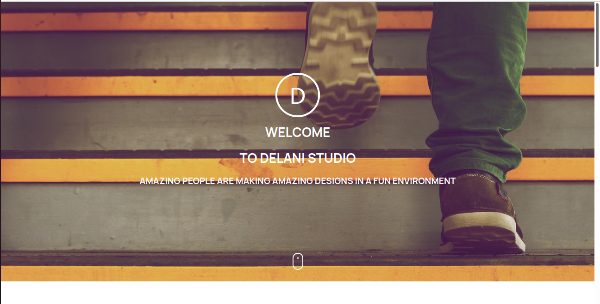

### **DELANI STUDIO** Author Maxwell Munene
_This project features a fictional studio and gives information about the services offered and projects done by the studio._

#### **DESCRIPTION**
*This project is the recreation of the landing page for a fictional studio using resources that include images used in the site, screenshots of how the website should look like, and videos of functionality.*
 (USER INTERFACE)

#### **LANGUAGES**
1. HTML
2. CSS
3. Javascript
4. Bootstrap
5. jQuery

#### **OBJECTIVES**
1. Recreate a website layout page
2. Toggle 'About what we do section'
* _Input: click on image_
* _Expected output: toggle between image and description_
3. Hover portfolio section
* _Input: hover over image_
* _Expected output: Name of services offered is displayed on white background_
4. Send message / Reply to team
* _Input: name. email, message_
* _Expected output: confirmation message_
5. Track user messages and emails using mail chimp

#### **CONTACT**
>Maxwell.Munene@student.moringaschoolcom  

#### **COPYRIGHT & LICENCE**
Distributed under the MIT License. See LICENSE for more information on license and copyright.
